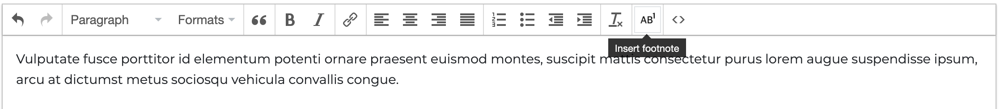
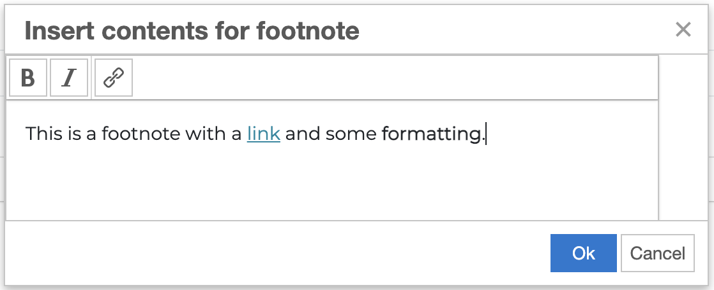

# footNotes
tinymce Editor 4.x / 5.x FootNotes Plugin.
> **JQuery is required (tinymce 4.x)**

This is a fork of https://github.com/rainywalker/footNotes. Contrary to the original version, this one allows formatting footnotes with HTML (using tinyMCE) and it also supports using double quotes in footnotes. Note: the HTML formatting only works for tinyMCE 4.x, the 5.x plugin is unchanged from the original.

The footnote plugin button in the menu bar of tinyMCE:



The footnote plugin dialog:



## Principle

The text entered in the insert contents window is stored in the 'data-content' attribute. Double quotes and single quotes or apostrophes are replaced with their respective HTML entities. Double quotes in HTML attributes (e.g. the href for a link) will be replaced with single quotes so they don't break the data-content attribute in which they are contained.

````
//html of button inserted in editor
<span id="#wk_ft1" class="fnoteWrap" contenteditable="false" data-mce-selected="1">
    <button class="fnoteBtn" type="button" data-content="the text entered">1</button>
</span>
````

## Usage
````
tinymce.init({
  selector: 'textarea',
  plugins: [
    'footnotes'
  ],
  toolbar: 'footnotes',
});
````
